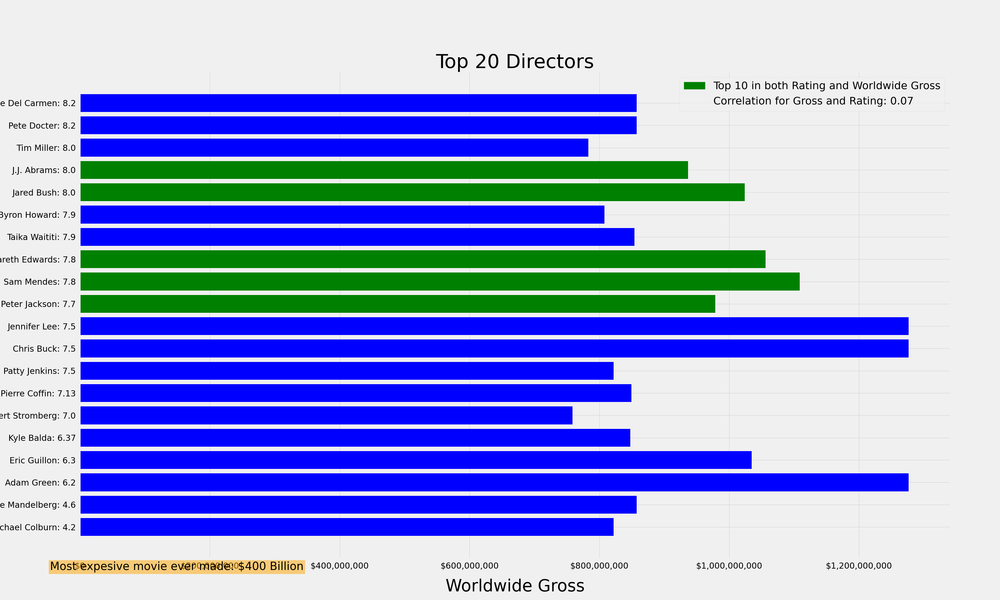

# Title

**Authors**: TJ Bray, Zach Hanly, Aalok Joshi, Jerry Vasquez

## Overview

This project analyzed  what types of films are currently doing best at the box office for Microsoft to potentially get into original video content. Using descriptive statistics and data from various online databases with information about movies, we have identified three solution areas within which we make recommendations. These are business partnerships, content selection and personnel/hiring. 

## Business Problem

Microsoft Studios has decided to create a new movie studio to create original video content like other big companies are doing. However, this is easier said than done. We see three main roadblocks or problems to expanding this line of business for Microsoft. Firstly this is a saturated marketplace that everyone seems intent on entering. Secondly, though Microsoft has experience in a variety of different industries, content production and streaming platforms are not amongst them. This lack of prior experience can result in expensive mistakes (i.e. Tubi or the Microsoft Zune). Finally the lack of experience also rolls over into Microsoft Studios’ lack of subject matter experts (directors, writers, etc.) and domain specific knowledge. 


## Data

The date is from five different sources: [IMDB](https://www.imdb.com/) and [Box Office Mojo by IMDb](https://www.boxofficemojo.com/), [Rotten Tomatoes](https://www.rottentomatoes.com/), [The Movie Database](https://www.themoviedb.org/?language=en-US), [The Numbers](https://www.the-numbers.com/). It was joined using unique ids for movies and crew, and also using movie names. 


## Methods

This project uses descriptive statistics to analyze the data for top performing studios, genres, directors and writers. This provides a general overview of the movies that are doing well at the box office.  


## Results

Present your key results. For Phase 1, this will be findings from your descriptive analysis.

***
Questions to consider:
* How do you interpret the results?
* How confident are you that your results would generalize beyond the data you have?
***

Here is an example of how to embed images from your sub-folder:

### Visual 1


### Visual 2


### Visual 3


### Visual 4


### Visual 5


## Conclusions
We recommend partnering with or buying IFC Films and/or Sony Pictures.
They are two proven movie studios who have a track record of creating
highly rated films.

We recommend creating Documentaries, Dramas, and Comedies. As they are
most likely to highly rated on Rotten Tomatoes and IMDb. 

We recommend creating a documentary with Sebastien Lifshitz, a comedies
with Simon Barett and Jamie Buckner. We would also recommend Dramas with
Nikhil Mehrota, Nitesh Tiwari, Piyush Gupta, or Barry Jenkins.

Our analysis may not solve the business problem because there is not a lot
of correlation with regards to return on investment and one specific factor.
There are many different reasons why a specific movie becomes successful and
there is not one specific recipe. However, our analysis leads us to believe
we have strong recommendations that would allow Microsoft to start their
movie making journey on the proper path.

Questions to consider:
* What would you recommend the business do as a result of this work?
* What are some reasons why your analysis might not fully solve the business problem?
* What else could you do in the future to improve this project?
***

## For More Information

Please review our full analysis in [our Jupyter Notebook](./filepath) or our [presentation](./filepath).

For any additional questions, please contact **name & email, name & email**

## Repository Structure

Describe the structure of your repository and its contents, for example:

```
├── README.md                           <- The top-level README for reviewers of this project
├── dsc-phase1-project-template.ipynb   <- Narrative documentation of analysis in Jupyter notebook
├── DS_Project_Presentation.pdf         <- PDF version of project presentation
├── data                                <- Both sourced externally and generated from code
└── images                              <- Both sourced externally and generated from code
```# microsoft_movie_project
